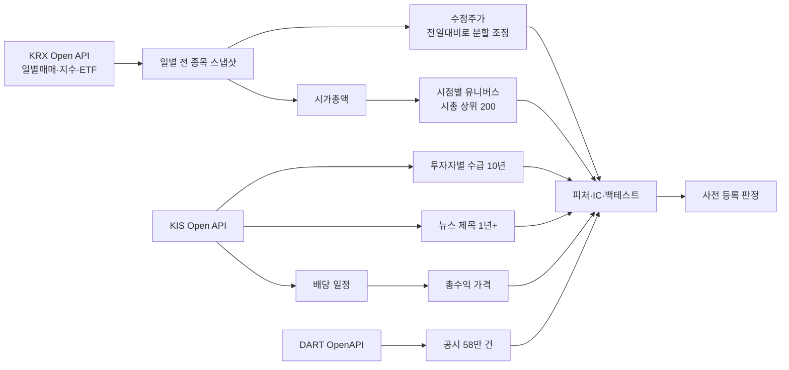

# K-Quant-Daily

[](https://github.com/sinkytiger/k-quant-research/actions/workflows/tests.yml)

**한국 주식 퀀트 리서치 파이프라인.** 공식 API만으로 10년치 데이터를 생존편향 없이 모으고,
모든 전략 가설을 **결과를 보기 전에 사전 등록**한 뒤 검증한다.

> 결론부터: 7개 가설을 사전 등록해 검증했고, 실제로 돈이 되는 전략은 아직 없다.
> 홀드아웃(2025-09-30 이후)은 **한 번도 쓰지 않았다.** 이 저장소가 보여 주는 것은 "이긴 전략"이 아니라
> **스스로를 속이지 않는 검증 절차**다.

---

## 1. 원칙

| 원칙 | 구현 |
|---|---|
| **공식 API만** | KRX Open API, 한국투자증권 KIS Open API, DART OpenAPI. 로그인 스크래핑(pykrx 등)은 쓰지 않는다 |
| **생존편향 없음** | 날짜별 **그날 상장된 전 종목** 스냅샷(이후 상폐·합병 종목 포함)으로 가격과 유니버스를 만든다 |
| **룩어헤드 금지** | 신호는 t 종가까지의 정보만 쓰고, 체결은 t+1 종가. 규칙마다 테스트로 고정한다 (pytest, CI) |
| **사전 등록** | 규칙·기간·판정 기준을 `docs/prereg/` 에 커밋한 **뒤에** 실행한다. 커밋 시각이 증거다 |
| **홀드아웃 1회** | 인샘플을 통과한 것만 `--confirm` 으로 한 번. 잠금 파일로 재실행을 막는다 |

## 2. 연구 기록 (사전 등록 7건)

| 날짜 | ID | 가설 | 결과 | 홀드아웃 |
|---|---|---|---|---|
| 09-28 | — | 저변동성 등 가격·수급 피처 롱온리 상위 20% | low_vol IC t +5.3 이지만 롱온리 4개 변형 모두 동일가중에 짐 | 미사용 |
| 09-28 | [`capw_exvol_v1`](docs/prereg/2026-09-28_capw_exclude_highvol.md) | 시총가중 − 고변동 20% 제외 | 제외 효과 연 +0.5%p, t 0.67. 지수에 짐 | 미사용 |
| 09-28 | [`voltarget_v1`](docs/prereg/2026-09-28_voltarget_kodex200.md) | KODEX200 변동성 타게팅 | MDD −31.7% (기준: 지수의 75% = −28.6%) 미달 | 미사용 |
| 09-29 | [`news_sent_v1`](docs/prereg/2026-09-29_news_sentiment.md) | 뉴스 제목 감성 (사후 시황 기사 제외, 5일 수익률 통제) | 방향 +, t 1.65 (기준 2.64). 7개월 표본 부족 | 미사용 |
| 09-30 | [`dart_events_v1`](docs/prereg/2026-09-30_dart_events.md) | 자사주 취득·유상증자·공급계약 공시 | 반응(+1.4%, −1.5%)이 **진입 전에 이미 끝남** | 미사용 |
| 09-30 | [`div_sig_v1`](docs/prereg/2026-09-30_dividend_signals.md) | 배당수익률 IC (총수익 라벨) | ✅ t 3.34 (20일), 3.00 (60일) | 백테스트와 묶음 |
| 09-30 | [`div_bt_v1`](docs/prereg/2026-09-30_dividend_backtest.md) | 배당 상위 20% 롱온리 (총수익·비용) | 동일가중 CAGR 12.2% > KODEX200 9.8% 이지만 유니버스 대비 t 1.11 (기준 2.24) | 미사용 |

**배운 것**
- 한국 대형주에서 **공개 정보로 늦게 들어가는** 전략은 비용을 넘기 어렵다. 공시 반응은 하루 안에 끝난다.
- IC 가 강해도 롱온리로 수익화되지 않을 수 있다. low_vol 의 IC 는 "가장 흔들리는 종목이 망한다"에서 나왔다(피하는 신호).
- 지수를 이긴 결과(배당 동일가중 +2.4%p/년)도 9년 표본에서는 우연과 구분되지 않을 수 있다. 기준을 결과에 맞춰 낮추지 않았다.
- 권고: 코어 ETF 보유. 매일 수집과 페이퍼 추적을 계속하고, 표본이 늘면 새 버전으로 다시 등록한다.

## 3. 데이터



| 데이터 | 출처 | 규모·비고 |
|---|---|---|
| 일봉(수정주가)·시가총액·종목명 | KRX Open API 유가증권·코스닥 일별매매 | 3,267종목, 2015-09~. 하루 1회 호출로 그날 상장 전 종목 |
| 시점별 유니버스 | 위 시가총액으로 구성 | 직전 거래일 시총 상위 200 보통주, 버퍼 220, 월초 스냅샷 129개 |
| 투자자별 순매수 | KIS 종목별 투자자매매동향 | 기준일을 30거래일씩 거꾸로 옮겨 10년, 상폐 종목 포함 |
| 현금배당 → 총수익 | KIS 예탁원 배당일정 | 3,298건. 배당락일 = 기준일에서 T+2 역산 |
| 뉴스 제목 | KIS 종목 뉴스 | 215종목 53만 건 (약 1년치, 매일 축적) |
| 공시 | DART OpenAPI | 유가증권 58만 건, 12개 분류 |
| 현재 지수 편입 | KIS 종목마스터 | KOSPI200 / KOSDAQ150 |

## 4. 실제 데이터에서 잡은 함정

데이터를 실제로 받아 보고서야 드러난 문제들이다. 각각 고치고 테스트로 고정했다.

| 함정 | 증상 | 대응 |
|---|---|---|
| ETF 수정가는 분배금 포함 | KODEX200 이 가격지수보다 연 2.4%p 높아 주식 전략이 불공정하게 불리 | 주식도 배당 포함 총수익을 만들어 같은 기준으로 비교. 배당 기여 2.39%p ≈ 2.45%p 로 검증 |
| 코스닥→코스피 이전상장 | 카카오·셀트리온 등 16종목의 코스피 이력이 코스닥 이력으로 덮어써짐 | 두 시장 스냅샷을 합쳐 종목별로 한 번에 재구성 |
| KIS 상장 전 채움 행 | 상장 전 날짜를 수급 0 으로 채워 줌 (10만 행) | 종가가 빈 행은 버림 |
| ETF API 휴장일 응답 | 빈 배열 대신 가격이 빈 행 → 휴장일 173일이 거래일로 저장 | 종가 유무로 판정, 휴장일은 주식 스냅샷으로만 기록 |
| 배당금 확정 시점 | 연말 기준일에는 배당금이 아직 미확정 → 기준일에 안다고 보면 누수 | 배당금은 **지급일**부터 안다고 가정 |
| 공시 시각 부재 | DART 목록은 날짜만 제공 | 다음 거래일 종가 진입(보수적). 반응이 그 전에 끝남을 확인 |
| KIS 호출 제약 | 15:40 전 당일 조회 차단, 동시 접속 과다 시 SESSION FULL | 조회 날짜 자르기, 일시 오류 재시도, 동시성 2 |

**누수 방지 규칙** (테스트로 고정): 유동성 필터·수급 분모 `shift(1)`, 수급 공표 시차 1일, 유니버스는 그 날짜 이전 스냅샷만·라벨보다 먼저, 휴장일 NaN 행 제거 후 수익률, expanding winsorize, 뉴스 15:30 컷오프, 중첩 수익률 t 는 Newey-West(lag 2h)·연율화 ×(252/h).

## 5. 운영

- **매일 08:40 (월~토)** `run_daily.bat`: KRX 스냅샷 증분 → KIS 수급·뉴스·시장 지표·휴장일 → DART 공시 → 페이퍼 NAV → 대시보드. PC 가 꺼져 있던 공백은 다음 실행에서 자동으로 메운다.
- **매주·매월** `run_weekly.bat`(상태 점검), `run_monthly.bat`(유니버스 재구성, 배당 갱신, 테스트).
- **대시보드** `outputs/dashboard.html`: 홈(오늘 요약·지수·업종 지도·순위·공시)·종목 상세·ETF·연구(기록·IC / 시장 국면 / 페이퍼 / 모니터)·데이터(상태·품질) 탭. 외부 요청 없는 로컬 파일, 종목별 데이터는 `outputs/stocks/` 에서 필요할 때 불러온다.
- **페이퍼 추적** `paper/portfolios.json`: 정의를 git 에 커밋해 추적 시작 시점을 남기고, NAV 는 데이터로 매번 재계산.
- **CI**: 푸시마다 GitHub Actions 에서 전체 테스트 (API 키·데이터 없이 가짜 데이터로).

## 6. 실행

```bat
python -m pip install -r requirements.txt
copy .env.example .env                      & REM KRX_API_KEY, KIS_APP_KEY/SECRET, DART_API_KEY
python scripts\collect_universe.py --check
python scripts\collect_universe.py --backfill --period 11y --markets stk ksq
python scripts\collect_flows.py --backfill --years 11
python scripts\collect_news.py --backfill
python scripts\collect_dart.py --backfill
python scripts\collect_dividends.py
python -m pytest
powershell -ExecutionPolicy Bypass -File scripts\setup_schedule.ps1   & REM 매일·매주 자동 실행
```

## 7. 구조

```
src/
  krx_api.py kis.py            공식 API 클라이언트 (한도·재시도·토큰 캐시)
  universe/                    스냅샷 → 수정주가·시총·유니버스·총수익 (krx_daily, membership, total_return)
  data/                        수급·뉴스·공시·배당 수집
  features/                    가격·수급·뉴스 감성·배당 피처, IC
  backtest.py allocation.py events.py stats.py paper.py
  dashboard/                   대시보드 템플릿
scripts/                       수집·연구·운영 진입점 (run_*.py 는 사전 등록 실행기)
docs/prereg/                   사전 등록 문서와 결과 부록
tests/                         누수 방지·수집·엔진 테스트
```


## 8. 한계

- 유니버스는 실제 KOSPI200 이 아니라 시총 상위 200 근사다(과거 구성종목은 공식 API 에 없다).
- 배당소득세·지급 지연은 무시했다. 비용 모형은 단순(왕복 0.33%)하고 시장 충격은 없다.
- 뉴스는 제목만, 약 1년치다. 공시는 시각이 없어 당일 반응을 검정하지 못했다.
- 홀드아웃 기간의 시장 흐름(대형주 급등, 2026-06~07 급락)을 알고 있어서, 각 등록 문서에 "알려진 오염"으로 적어 두었다.
- 문서·코드 주석의 "기획서 N장"은 공개하지 않은 내부 재구축 기획 문서를 가리킨다. 사전 등록 문서에는 그 규칙의 값을 모두 옮겨 적었다.
